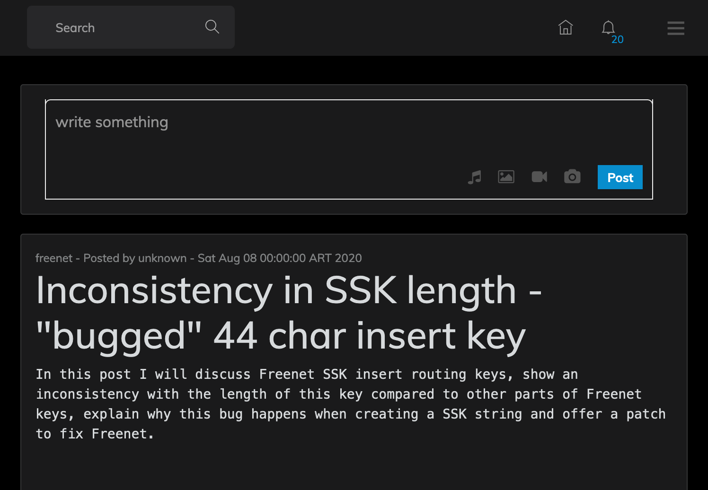

# FMSweb - web frontend for jFMS

Very early prototype. Only for testing.

# Running

- First you'll need to run jFMS locally

The `jfms.db3` is a SQLite3 database created usually on the jFMS root directory. Grab that file to display it on the web frontend.

- Start Springboot

Run with `./gradlew spring-boot:run`